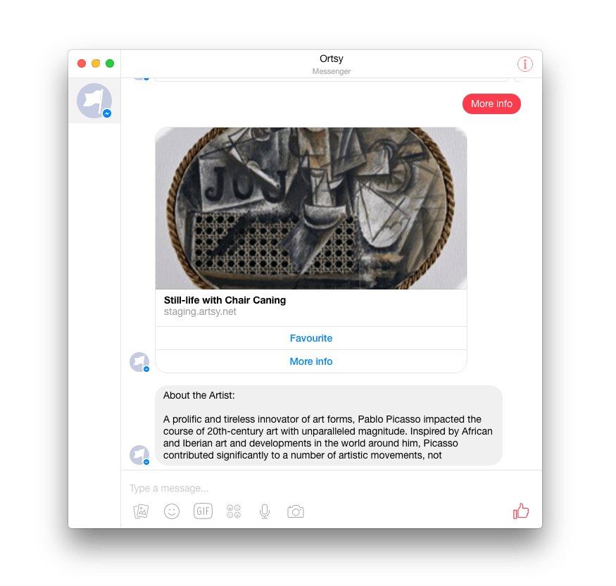

### Mitosis

A Facebook Messenger bot for Artsy.

Allows you to explore Artworks, Artists and Articles in a pretty deep way by just clicking around.  



Currently it's being hosted on my personal heroku, and with my own personal facebook app "Ortsy-art". Will be migrated into a real staging environment at some point.

### App Structure

This is an Express app (see [mitosis.js](source/mitosis.js)), that relies on [Flow](https://flowtype.org) to interact with the Facebook API. It interacts with Facebook via a single `"/webhook"` response, and a single post API to Facebook.

If this style of JavaScript is new to you, consult the [Danger JS guide](https://github.com/danger/danger-js/blob/master/docs/js_glossary.md).  

The app splits into a few sections: `bot`, `db` and `facebook`. The [bot](source/bots) is comprised of some core classes, then contexts. Each context is a section of the artsy browsing experience ( e.g. artist, artwork, gene etc.) 

### Want to test it?

You need to have Orta add your Facebook account to the testers page ([link](https://developers.facebook.com/apps/1084256578353668/roles/)). Then go to the [heroku page](https://orta-artsy-facebook-bot.herokuapp.com) and click "Message Us".

The easiest way to start is to say "trending artists", then start interacting via the buttons that are provided.

If you want to see all off the potential elements we can use, say any of: `"gif", "audio", "video", "image", "file", "button", "generic", "receipt", "quick reply", "read receipt", "typing on", "typing off", "account linking"`. 

### Read More

* [Messenger API docs](https://developers.facebook.com/docs/messenger-platform)
* [Messenget Platform Guidelines](https://developers.facebook.com/docs/messenger-platform/guidelines)

### What is the focus?

* Providing another way to subscribe to Artsy Articles
* Offer a way to dive into some of our data

### Setting up for Dev

Clone the repo, run `yarn install`

```sh
git clone https://github.com/artsy/Mitosis.git
cd mitosis
yarn install
```

This is still a bit rough around the edges for contributors. As you cannot easily use the Facebook API to send you webhook notifications to you. However, to run a copy of the server, create a copy of `config.default.json.example` and make it `config.default`.   

### TODO:

* Allow you to connect to your Artsy account
* Offer a way to get occasional notifications to trigger exploration 
* Think about what chat-like interfaces feel like in practice
* Xapp tokens will need a way to consider themselves out of date, and get new ones

This is based on the Facebook Sample app, then I added flow, and started making it [a real project](https://github.com/fbsamples/messenger-platform-samples).
